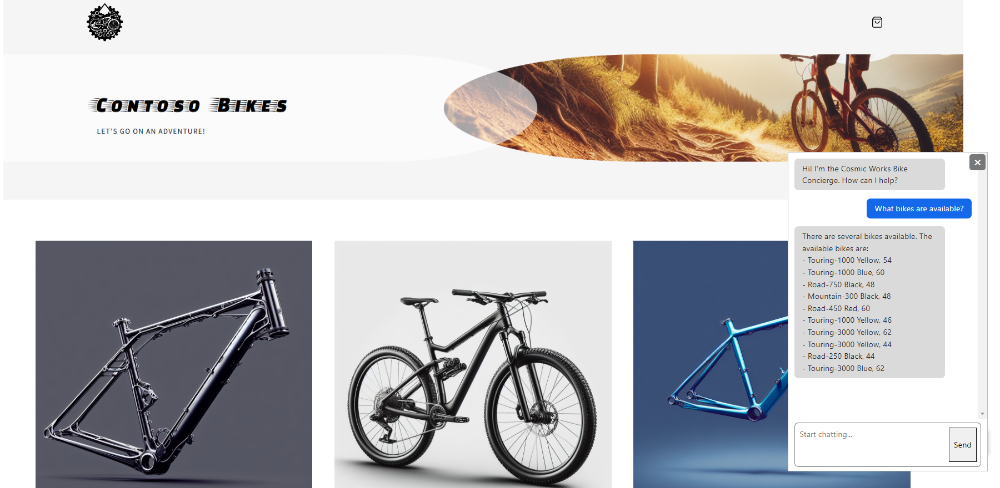

## Getting Started

Welcome to the repository. This project serves as a demonstration of building a .NET application with a backend API. The core of the application leverages Azure Cosmos DB for MongoDB vCore as its datastore, and also configured for vector search capabilities.

##### Components 
- DotNet Application: Blazor .NET application for the frontend UI

- Backend API: C# backend API that serves as the backbone for the sample application and the chatbot system.

- Azure Cosmos DB for MongoDB vCore: Azure Cosmos DB for MongoDB vCore as a powerful and flexible NoSQL database solution.

- Vector Search: Witness the implementation of vector search within Cosmos DB for MongoDB vCore , a cutting-edge feature that enhances the chatbot's ability to understand and respond to user queries.

- WIP - Add Ordering components 
-  WIP - Add Authentication 
  
 


### Prerequisites
- Azure Subscription
- Subscription access to Azure OpenAI Service. Start here to [Request Access to Azure OpenAI Service](https://customervoice.microsoft.com/Pages/ResponsePage.aspx?id=v4j5cvGGr0GRqy180BHbR7en2Ais5pxKtso_Pz4b1_xUOFA5Qk1UWDRBMjg0WFhPMkIzTzhKQ1dWNyQlQCN0PWcu)

### Installation

1. Fork this repository to your own GitHub account.

2. To deploy with Github actions follow the instructions [generate deployment credentials](https://learn.microsoft.com/en-us/azure/app-service/deploy-github-actions?tabs=userlevel%2Caspnetcore#1-generate-deployment-credentials) to create a service principle and crate a secret for GitHub Actions, this will allow GitHub to authenticate with Azure

3. Configure the GitHub secret in GitHub, browse your repository. Select Settings > Security > Secrets and variables > Actions > New repository secret. To use user-level credentials, paste the entire JSON output from the Azure CLI command into the secret's value field. Name the secret AZURE_CREDENTIALS.
When you configure the GitHub workflow file later, you use the secret for the input creds of the Azure/login. For example:

```
- uses: azure/login@v1
  with:
    creds: ${{ secrets.AZURE_CREDENTIALS }}
```

4. Create an additional secret to hold the password for Mongo DB the secret name should be MONGO_DB_PASSWORD

5. Run the GitHub action by selecting "Actions" in the GitHub menu and select the "Deploy" action from the menu.

## Chat / Vector Search Configuration

The Vector search was adopted from the solution [Vector Search & AI Assistant for Azure Cosmos DB for MongoDB vCore](https://github.com/Azure/Vector-Search-AI-Assistant-MongoDBvCore)

This solution demonstrates how to design and implement a RAG Pattern solution that incorporates Azure Cosmos DB for MongoDB vCore vector database capabilities with Azure OpenAI Service to build a vector search solution with an AI assistant user interface. The solution shows how to generate vectors on data stored in Azure Cosmos DB for MongoDB vCore using Azure OpenAI Service, then shows how to generate vectors from natural language user input which is then used in to perform a vector search using Azure Cosmos DB for MongoDB vCore.

Visit the repo for more details and usage of the reference project!!

## Contributing

This project welcomes contributions and suggestions.  Most contributions require you to agree to a
Contributor License Agreement (CLA) declaring that you have the right to, and actually do, grant us
the rights to use your contribution. For details, visit https://cla.opensource.microsoft.com.

When you submit a pull request, a CLA bot will automatically determine whether you need to provide
a CLA and decorate the PR appropriately (e.g., status check, comment). Simply follow the instructions
provided by the bot. You will only need to do this once across all repos using our CLA.

This project has adopted the [Microsoft Open Source Code of Conduct](https://opensource.microsoft.com/codeofconduct/).
For more information see the [Code of Conduct FAQ](https://opensource.microsoft.com/codeofconduct/faq/) or
contact [opencode@microsoft.com](mailto:opencode@microsoft.com) with any additional questions or comments.

## Trademarks

This project may contain trademarks or logos for projects, products, or services. Authorized use of Microsoft 
trademarks or logos is subject to and must follow 
[Microsoft's Trademark & Brand Guidelines](https://www.microsoft.com/en-us/legal/intellectualproperty/trademarks/usage/general).
Use of Microsoft trademarks or logos in modified versions of this project must not cause confusion or imply Microsoft sponsorship.
Any use of third-party trademarks or logos are subject to those third-party's policies.
